# Work Log 2026 week 3

-------------------------------
## 12/01/2026

### Cloos
**Project:** 25380 (hkw7 Oranjewind) | **Part:** 340101 (Tubular)
*Tags: #RootWelding #Testing #pores*

*   continue testing, and pores are still forming, mostly against the attached plate
    *   stickout has been reduced to give better gas protection to the weld but as its only against the plate and not the other side against the tube
        *   heatinput is  reduced to check for effect / no change
        *   if it was gasflow protection problem, it would be throughout all of the weld , and its specifically against the attached plate.
        *   steel contamination is les likely to be the problem as the weld is good when we tested it on the attached piece
        *   probably vortex as air gets sucked in when filling / welding against the attached plate.

### Yaskawa
**Project:** 25380 (hkw7 Oranjewind) | **Part:** Number (SFF ring connections)
*Tags: #Tag*

*   
*Tags: #Transport #Setup #Testing #Truearc*

*   Transport of the cobot to SPB site in Hoboken Antwerp
    -   setup the cobot at the site
    -   tested welding with the cobot
*   Truearc compensate for the esab powersource callibration
    -   go to the I/O list outputs and turn in/on compensation on and then back to off , 0.5 sec minimum
    -   then there should be a rsult in the esab webapp / Esab Connect HMI
        - message is from Steven Luyten VSE, he got it from robotica esab Zweden

### Teqram

*   

-------------------------------
## 13/01/2026

### Cloos
**Project:** 25380 (hkw7 Oranjewind) | **Part:** 340101 (Tubular)
*Tags: #RootWelding #Testing #Assembly #Gap*

*   root is starting to look good, still grinding , placing ceramic for welding root, gap for fin is 4mm
    -   <a href="images/week_3/25380_340101_assembly_fin_gap_4mm.jpg">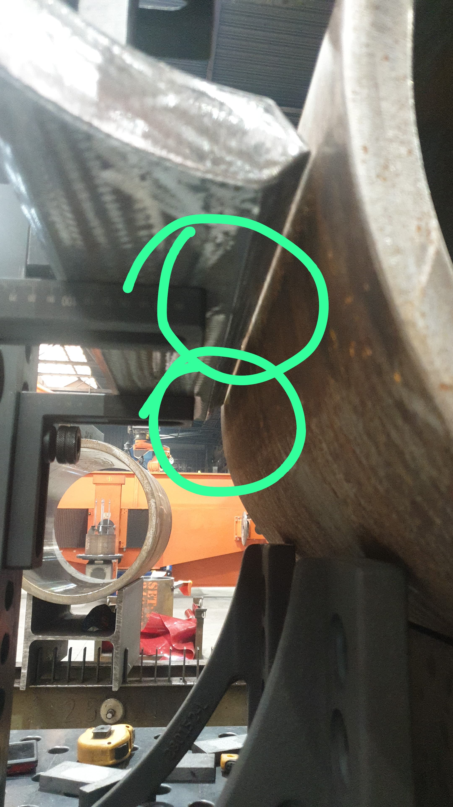</a>
      <a href="images/week_3/25380_340101_root_fin_before_grind.jpg">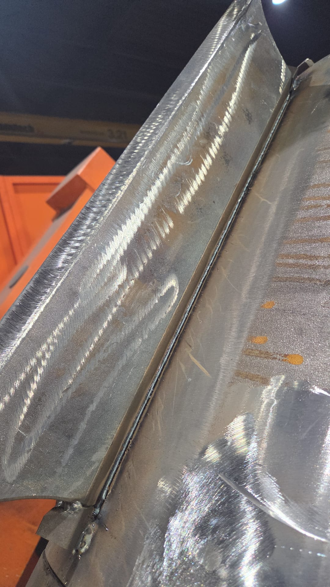</a>
      <a href="images/week_3/25380_340101_root_fin_after_grind.jpg">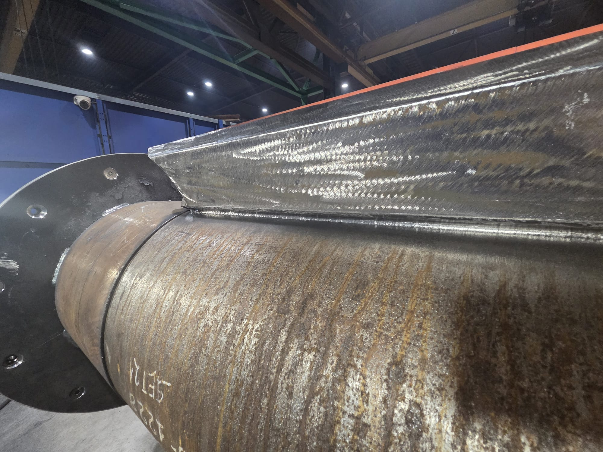</a>
*   table is adjusted to have the fin in the right place from the start
    -   <a href="images/week_3/25380_340101_assembly_table_adjusted_to_attach_fin_at_start.jpg">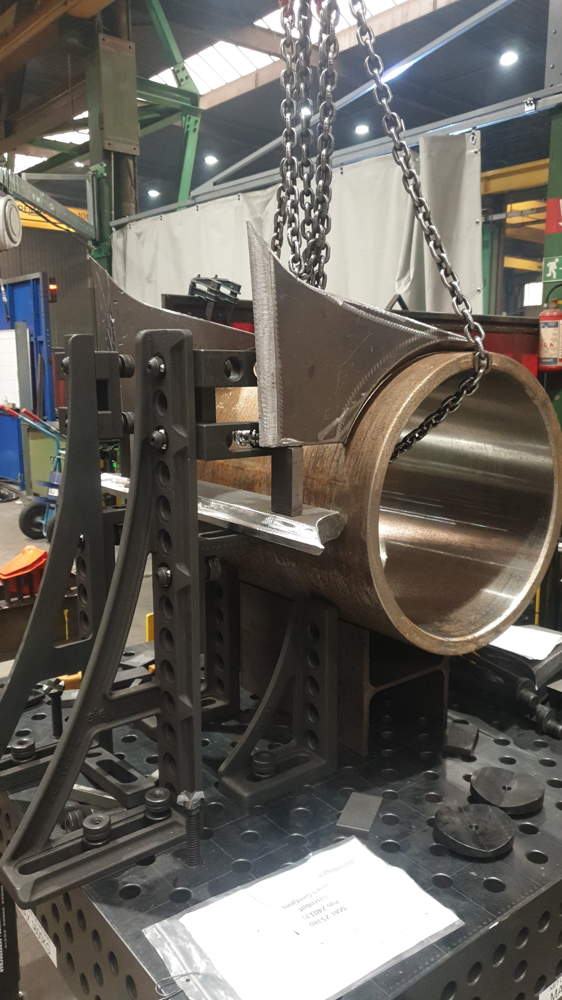</a>
*   client requested 50mm tackweld on the runin / runoff plate
    -   <a href="images/week_3/25380_340101_assembly_placing_runinoff.50mm_tackweldjpg.jpg">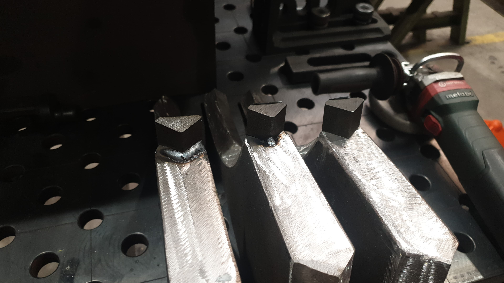</a>
      <a href="images/week_3/25380_340101_assembly_50mm_tackweld_runinoff.jpg">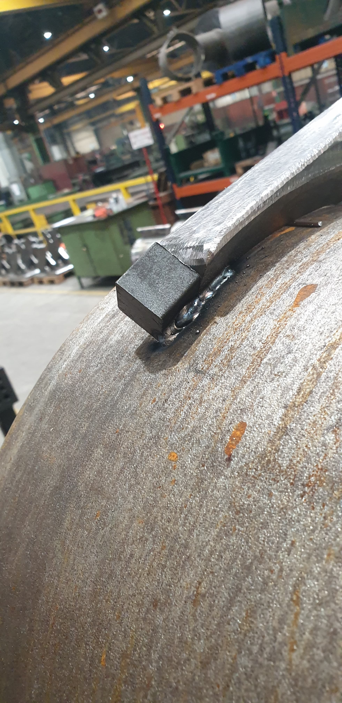</a>
*   assembly of the 4ears gap for the ears is 3mm
    -   <a href="images/week_3/25380_340101_assembly_4ears_gap_3mm.jpg">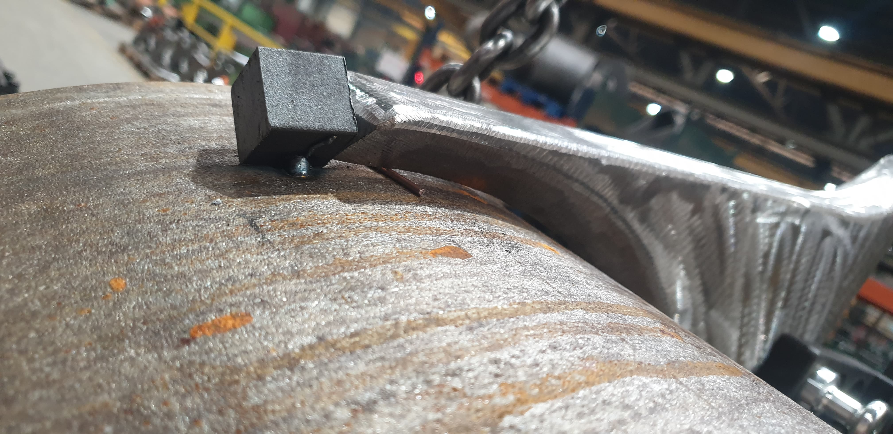</a>
      <a href="images/week_3/25380_340101_assembly_4ears_support.jpg">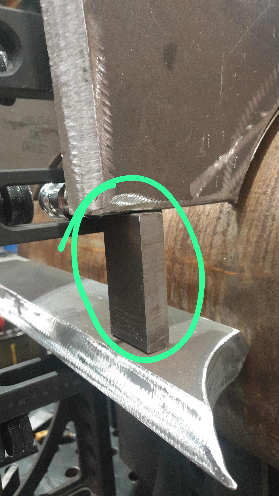</a>

### Yaskawa
**Project:** 25380 (hkw7 Oranjewind) | **Part:** Number (SFF ring connections)
*Tags: #Setup #Testing #welding #UT *

*   welded 1 ring connection
    -   the connection had flaws in UT 45mm to 90mm in the volume 10mm in -Y direction, middle section of the weld in x direction, no flaws in the beginning or end of the weld
        - when arc air was performed the faults where observable
            - lack of fusion against the wall of the connction
            - pores 

### Teqram

*   

-------------------------------
## 14/01/2026

### Cloos

*   

### Yaskawa 

*   

### Teqram
**Project:** 25380 (hkw7 Oranjewind) | **Part:** number (switchgear triangle) 
*Tags: #Chisel *

*   problem with performing the chisel procedure on the long running triangle part of the switchgear part was observed by Dries
    -   no appearant reason was brought forward as they skipped the chisel procedure so they could continue
        -   <a href="images/week_3/chisel_triangle_problem.jpg">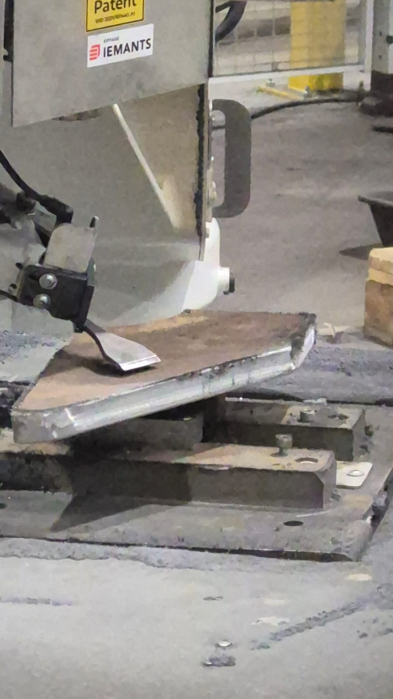</a>

**Project:** unknown | **Part:** number (unknown part) 
*Tags: #Collision *

*   problem with a new part was posted in the whatsapp groupchat by Benny Gys
    -   collision interference was detected by the software on flipper side A
        -   unknown part thickness and program that was run atm
            - asked Benny to provide the program and thickness of the part
            - <a href="images/week_3/collision_unknown_part.jpg">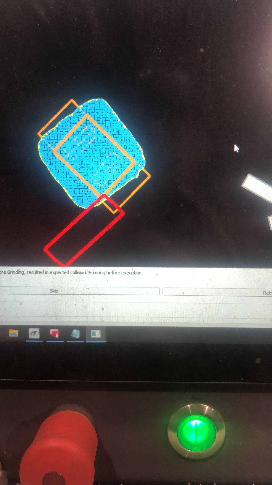</a>

-------------------------------
## 15/01/2026

### Cloos

*   

### Yaskawa
**Project:** 25380 (hkw7 Oranjewind) | **Part:** Number (SFF ring connections)
*Tags: #Setup #Testing #welding #UT *

*   welded 2nd ring connection
    -   the connection had flaws in UT 40mm to 65mm in the volume 0mm in Y direction, complete section of the weld in x direction
        - Florin witnessed the welding first hand , he confirmed that the visual looked ok and the process seemed fined as was the setup of the weld beads in the volume
        - arc air was not yet performed on the connection to check the flaw detected by UT 
        

### Teqram

*   

-------------------------------
## 16/01/2026

### Cloos

*   

### Yaskawa
**Project:** 25380 (hkw7 Oranjewind) | **Part:** Number (SFF ring connections)
*Tags: #Setup #Testing #welding #UT #ESO *

*   welded 3rd ring connection
    -   the setup was double checked and spacing in the middle was sometimes adjusted a little to have an opening for the next weld of minimum 3mm
        -   layer 2 byte label 1 (aka bead number 1) was not performed but is needed for the height as in the end we came up short, and this also explains the higher ESO of 23mm instead of the 16mm
        -   <a href="images/week_3/120mm_layer_1.jpg">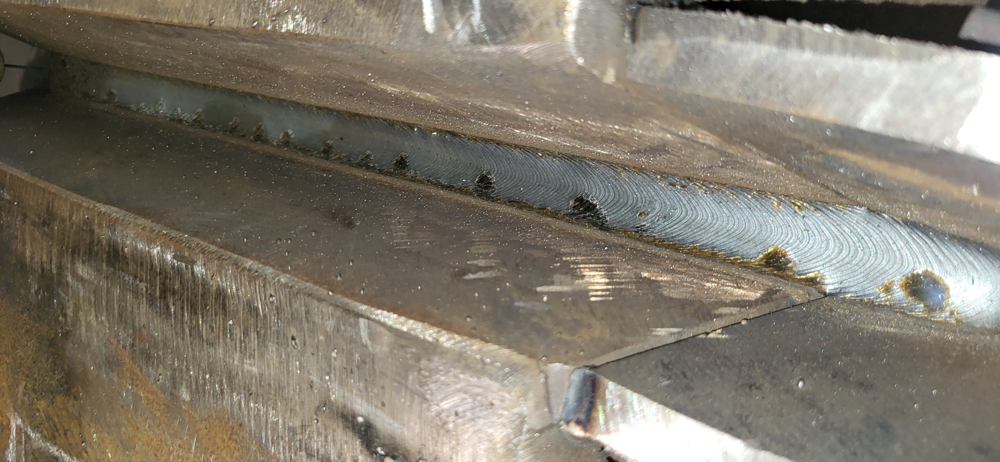</a>
            <a href="images/week_3/120mm_layer_3.jpg">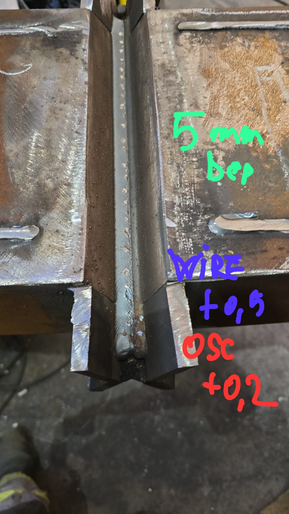</a>
            <a href="images/week_3/120mm_layer_4.jpg">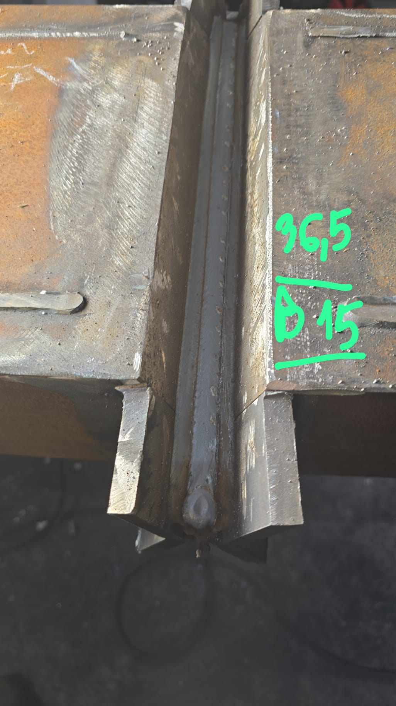</a>
            
            <a href="images/week_3/120mm_layer_6.jpg">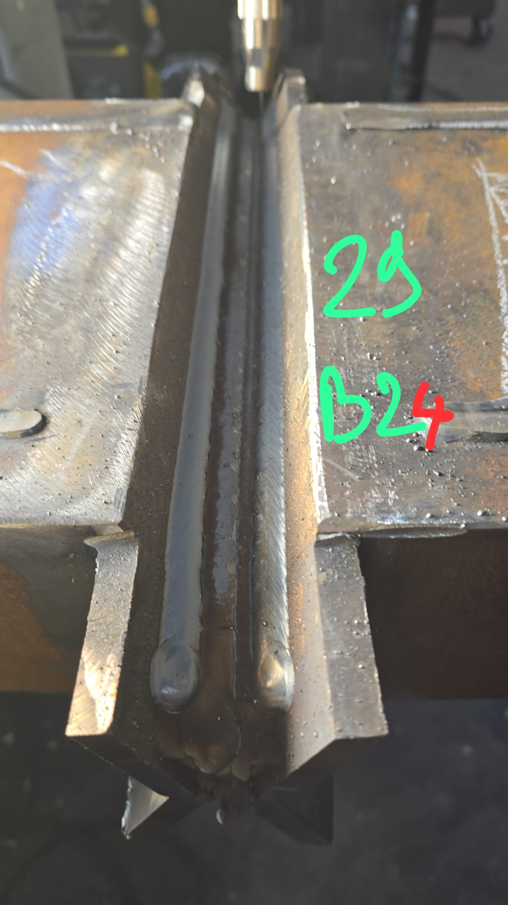</a>                   
            <a href="images/week_3/120mm_layer_7.jpg">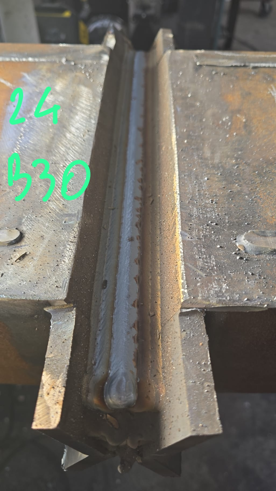</a>
            
            <a href="images/week_3/120mm_layer_9.jpg">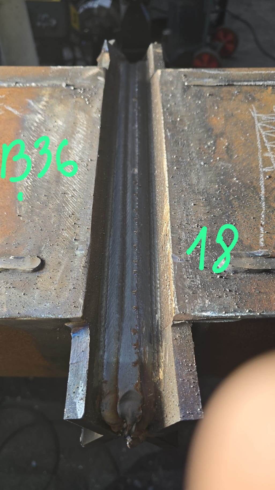</a>
            <a href="images/week_3/120mm_layer_10.jpg">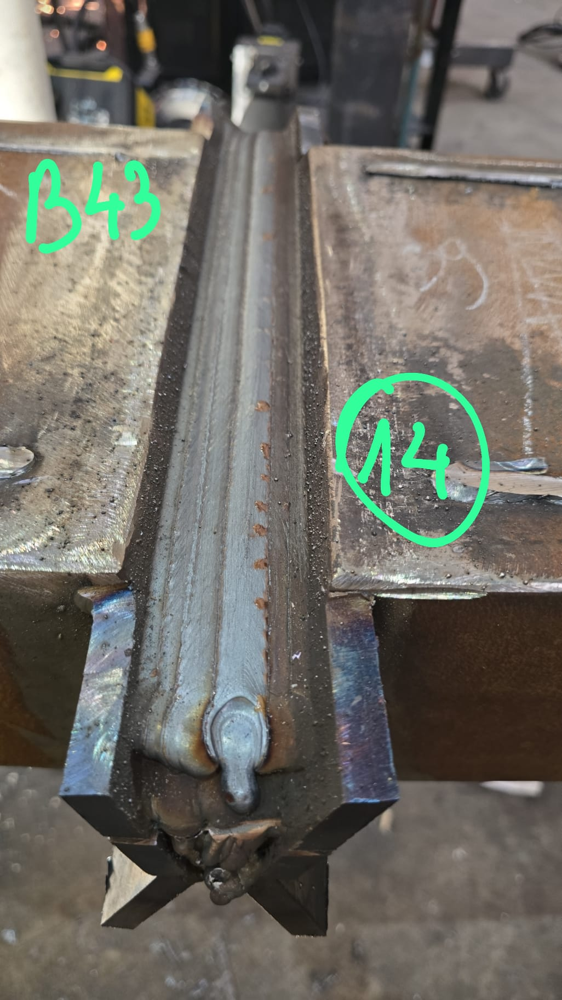</a>
            <a href="images/week_3/120mm_layer_11.jpg">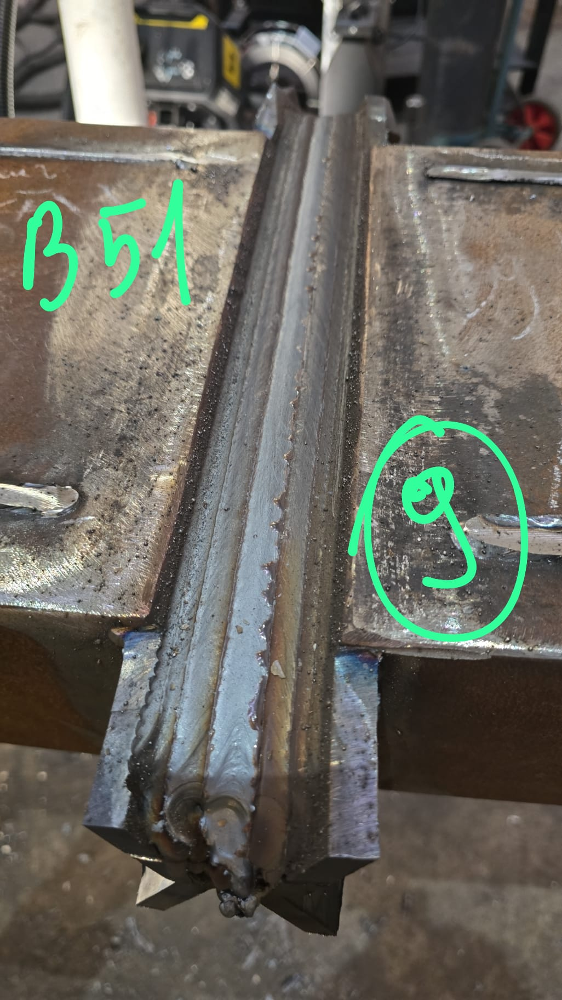</a>
            <a href="images/week_3/120mm_layer_12.jpg">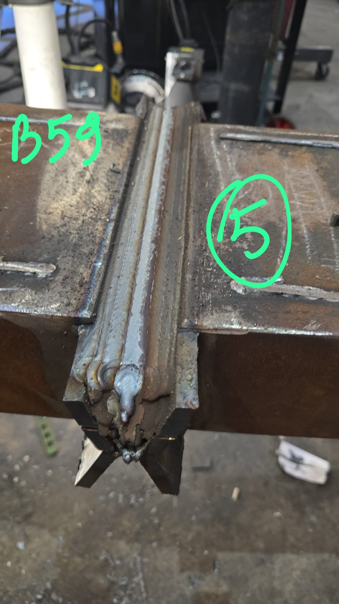</a>
            <a href="images/week_3/120mm_layer_13.jpg">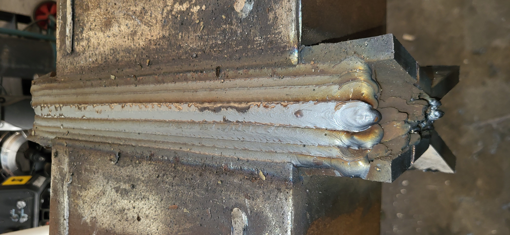</a>
            <a href="images/week_3/120mm_layer_13_side.jpg">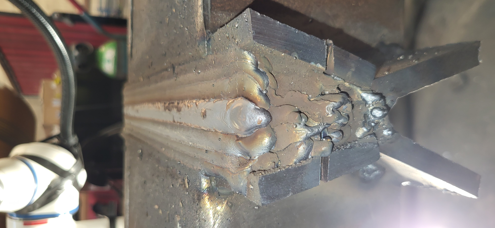</a>
    -   added more wire from 8.0 to 9.0 to have more amperage as to be able to have less lack of fusion.
        -   amperage went from 220A to 245A
        -   this did mean we sometimes needed to skip a bead as sometimes the opening was less then 1.5mm and we needed a minimum of 3mm
    -   ESO (electric stick out) was changed to 16mm from 20mm (and observed 23mm on one occasion)
        - ESO change seemed to prevent the froming of small pores sometimes observed
            - checked every layer by grinding the end and realy small part of the middle to check for pores
                - no pores were detected at the grind checks 
    -   in the second layer there was a lot of pores when we welded,  at the same time one of the manual welders also had pores in his weld
        -   the manual welder was welding on the same ring but other connection and the gas was coming from the same wall connection
        -   
        -   might not be related to each other but worth noting
        -   all gasflow and setting in the powersource list regarding gasflow was checked
        -   Florin checked the wall that dispensed and connect the gashose to the robot for problems or leaks
            - no problems or leaks were detected , gasflow was back to normal
                - side note : day 13/01 gasflow was 19 l/min, day 14/01 gasflow was 14 l/min put it up to 23 l/min, day 15/01 gasflow was 21 l/min, day 16/01 gasflow was 19 l/min, gasflow seems to be inconsistent , normally the setting in the list should be the same as the setting on the wall.
                this was not the case there also was an instance where the powersource gave an error that the set gasflow rate could not be achieved as it was set to 26.5 l/min but the actual gasflow was less for x amount of time and then the error comes up.
    

### Teqram

*   

-------------------------------
## 17/01/2026

### Cloos

*   

### Yaskawa

* 

### Teqram

*   

-------------------------------
## 18/01/2026

### Cloos

*   

### Yaskawa

*   

### Teqram

*   